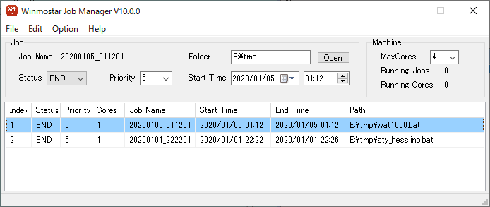

.. _winmosjm_top:

Winmostar Job Manager
============================================

| 　Winmostarジョブマネージャ（Winmostar/JM）は、マルチコアのWindows PCを対象にしたジョブ管理ソフトウエアです。
| 　Winmostarの補助プログラムとして動作し、WinmostarをインストールしたPC（ :dfn:`ローカルマシン` と呼ぶ）上でGAMESS、Gaussianなど各種ソルバの実行を自動でスケジューリングすることができます。

基本動作
^^^^^^^^^^^^^^^^^^^^^

| 　Winmostarでローカルマシン上でのジョブ（ :dfn:`ローカルジョブ` と呼ぶ）を実行を選択すると、下図のようなJMのウィンドウが立ち上がり、1番目のキューに登録されます。キューに登録されたジョブの :guilabel:`Status` はまず :guilabel:`wait` （実行待ち）となり、登録順、 :guilabel:`Priority` 、実行core数を考慮して順次 :guilabel:`run` に切り替わり、そのジョブが開始されます。処理が終了したジョブの :guilabel:`Status` は :guilabel:`end` に切り替わります。
| 　JMはWinmostarでローカルジョブを実行する時に自動で起動されますが、自動で終了することはないので、終了するときは ``x`` （閉じる）ボタンか :menuselection:`File --> Exit` から終了します。JMを終了すると、それ以降は :guilabel:`wait` 状態のジョブは開始されません。
| 　誤ってJMを停止した場合などJMを任意のタイミングで起動したい場合は、Winmostar本体の :menuselection:`ツール --> ジョブマネージャ` をクリックします。
| 　 :guilabel:`MaxCores` はJMが使用できる最大コア数で、デフォルトではマシンのコア数に設定されます。この値が大きいと同時に多数のジョブが並列に実行されますが、ローカルマシンのコア数より多く設定しても効率は上がりません。

.. hint::
   Windowsのタスクマネージャーを起動し、 :guilabel:`パフォーマンス` タブに移動すると、 :guilabel:`論理プロセッサ数` という欄に使用しているマシンのコア数が表示されます。

| 　ジョブは基本的に :guilabel:`wait` 状態の古いジョブから順に実行されますが、 :guilabel:`Priority` を変更することでその順序を調整することができます。 :guilabel:`Priority` が小さい値のジョブほど高優先度で実行されます。
| 　実行core数は、使用するソルバのキーワードで設定した値に設定されます。例えば、G03Wの場合は%nproc=の値、GAMESSの場合はNCPUSの値となります。G03Wは並列計算版が必要で、最大4コアまでの制限があります。
| 　JMは二重に起動しないように調整されており、Winmostarを複数起動した場合、ジョブは一つのJMに対して登録されます。
| 　JMが管理可能なジョブの数（キューの数）は最大で200個です。この数を超えると、古いものから順にキューから削除されますが、実行中のジョブがキューから削除されても、ジョブの処理自体は続行されます。

   |JMwindow|

.. note::

   MOPACに対しては、Winmostar本体の環境設定でJMの使用の有無を選択できます。JMを使わない場合はMOPAC計算後に自動的に計算結果がWinmostarのメインウィンドウに読み込まれますが、JMを使う場合はジョブの終了後にユーザが明示的に計算結果をWinmostar上で読み込ませる必要があります。

.. _jm_forcequit:

ジョブを強制終了・キャンセルする方法
^^^^^^^^^^^^^^^^^^^^^^^^^^^^^^^^^^^^

| 　 :guilabel:`run` 状態（実行中）のジョブを強制終了したい時は、そのジョブのプロンプト（DOS）ウィンドウの ``x`` （閉じる）ボタンを押します。JM上で :guilabel:`run` 状態のジョブの行をクリックして :guilabel:`Status` を :guilabel:`end` に変更することでも終了できる場合もありますが、MOPAC2009など一部のソルバではその操作が効きません。
| 　JMで :guilabel:`run` 状態のジョブの行をクリックすると、そのジョブのDOSウィンドウが前面に表示されます。
| 　 :guilabel:`wait` 状態のジョブをキャンセルしたい場合は、そのジョブの行をJMで選択し、 :menuselection:`Edit --> Delete Job` かキーボードの :kbd:`Delete` キーを押してキューから削除します。キューから削除せずに実行させない場合は、 :guilabel:`Status` を :guilabel:`wait` から :guilabel:`end` に変更します。

開始時刻の指定して実行する方法
^^^^^^^^^^^^^^^^^^^^^^^^^^^^^^^

| 　ウィンドウに表示される開始時刻は、 :guilabel:`wait` の時は実行キューに登録された時刻ですが、 :guilabel:`run` になった時にその時刻に変更されます。
| 　開始時刻に未来の時刻を設定することで、実行を遅らせることが可能です。一旦 :guilabel:`run` 状態になったジョブについても、 :ref:`jm_forcequit` の方法で強制終了した後、開始時刻を変更し :guilabel:`Status` を :guilabel:`wait` に変更すると、再度ジョブを実行することも可能です。（例えば、この方法を用いると、後で実行したいジョブの動作を事前に確認することができます。）

ジョブを強制的に開始する方法
^^^^^^^^^^^^^^^^^^^^^^^^^^^^

| 　 :guilabel:`wait` 状態のジョブの :guilabel:`Status` を :guilabel:`run` に変更することで、その他の条件を無視して強制的に処理を開始することができます。同様に :guilabel:`end` 状態のジョブを :guilabel:`run` に変更して再開することもできます。

省電力設定について
^^^^^^^^^^^^^^^^^^^^^

| 　JMの起動中は、時間設定によって自動的にスタンバイ（スリープ）や休止状態に入ることを、JMが防止しています。手動操作でスタンバイ状態等に移行した後、テレビ録画ソフトのように自動的に復帰する機能はありませんので、ご注意ください。
| 　 :guilabel:`AutoShutdown` にチェックした場合は、全てのジョブが :guilabel:`end` 状態になった後に自動的にシャットダウンします。

